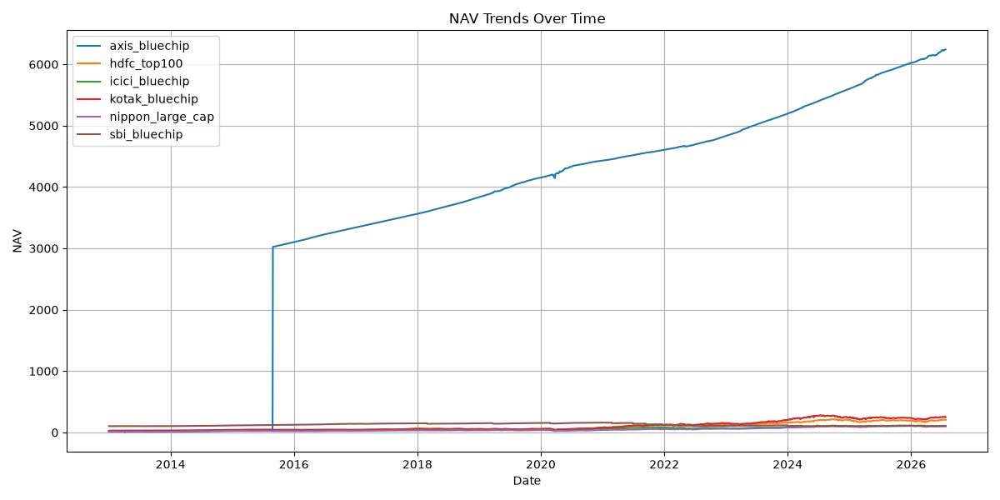

# Mutual Fund Analytics Report

## 1. Introduction
- Purpose of the project
- Funds analyzed (SBI Bluechip, ICICI Bluechip, Nippon Large Cap, Axis Bluechip, Kotak Bluechip, HDFC Top 100)

## 2. Data Preparation
- Raw NAV data fetched from mfapi.in
- Cleaned dataset saved in `data/processed/cleaned_nav.csv`
- Returns calculated and saved in `nav_with_returns.csv`

## 3. NAV Trends
- Line chart: `reports/nav_trends.png`
- Observations: overall growth patterns, fund comparisons
-

## 4. Performance Analysis
- Best performing fund (highest NAV growth)
- Volatility comparison (standard deviation of returns)
- Average returns per fund

### Average Returns (per fund)
- Axis Bluechip: -0.000540
- HDFC Top 100: -0.000833
- ICICI Bluechip: inf (data issue)
- Kotak Bluechip: -0.000581
- Nippon Large Cap: -0.000517
- SBI Bluechip: 0.000005

### Volatility (Standard Deviation of Returns)
- Axis Bluechip: 0.016495
- HDFC Top 100: 0.009645
- ICICI Bluechip: NaN (no valid data)
- Kotak Bluechip: 0.009794
- Nippon Large Cap: 0.010619
- SBI Bluechip: 0.005745

## 5. Insights
- SBI Bluechip was the most stable fund (lowest volatility: 0.005745).  
- Axis Bluechip showed the highest volatility (0.016495), meaning higher risk.  
- ICICI Bluechip data has issues (returns = inf, volatility = NaN) and needs cleaning.  
- Overall, SBI Bluechip gave slightly positive returns, while most others were negative.

## 6. Conclusion
- Summary of findings
- Recommendations for next steps (e.g., dashboard, SQL integration)
